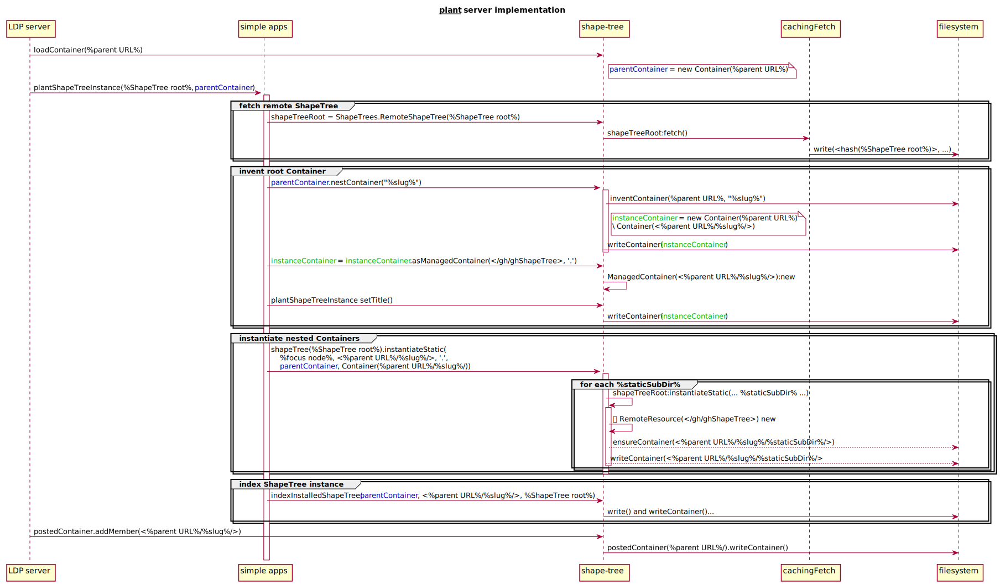

# shapetree.js (archived)

*This is an old prototype of shapetrees and does not conform with the current specification.* It has a built-in Solid server as it pre-dates https://github.com/CommunitySolidServer/CommunitySolidServer

ShapeTrees maps resource hierarchies to shape constraints. This is a Solid work product -- https://github.com/solid/data-interoperability-panel

See the [test-suite README](https://github.com/shapetrees/test-suite/#installation) for installation instructions.

